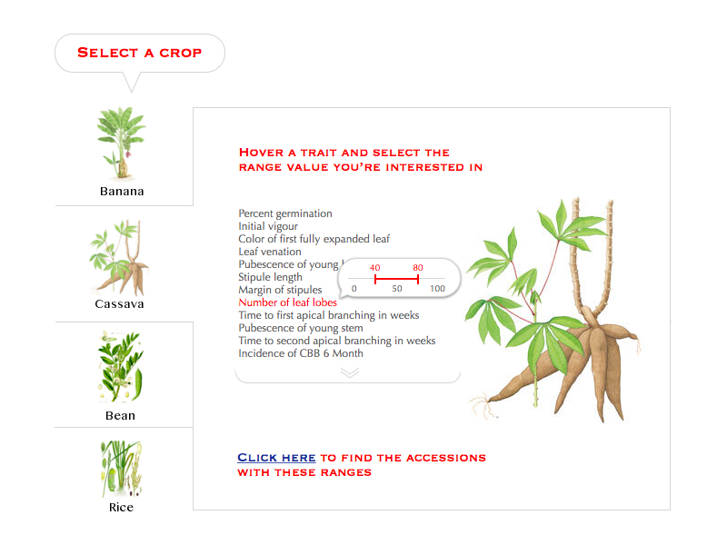

# Genesys 2 User Interface

A software project should always start by building its User Interface; even though software is made out of many different components, the foremost concern should be appearance—what and how information is presented.

The designer should ask: What is relevant information? What questions will the viewers ask? What situations will they want to compare? What decisions are they trying to make? How can the data be presented most effectively? How can the visual vocabulary and techniques of graphic design be employed to direct the user’s eyes to the solution? The designer must start by considering what the software looks like, because the users are using it to learn, and they learn by looking at it.

If a user is searching for **accessions**, what questions might they have?

- How do I find accessions with specific passport information?
- How do I find accessions with specific trait values?

## How do I find accessions with specific trait values? 

    