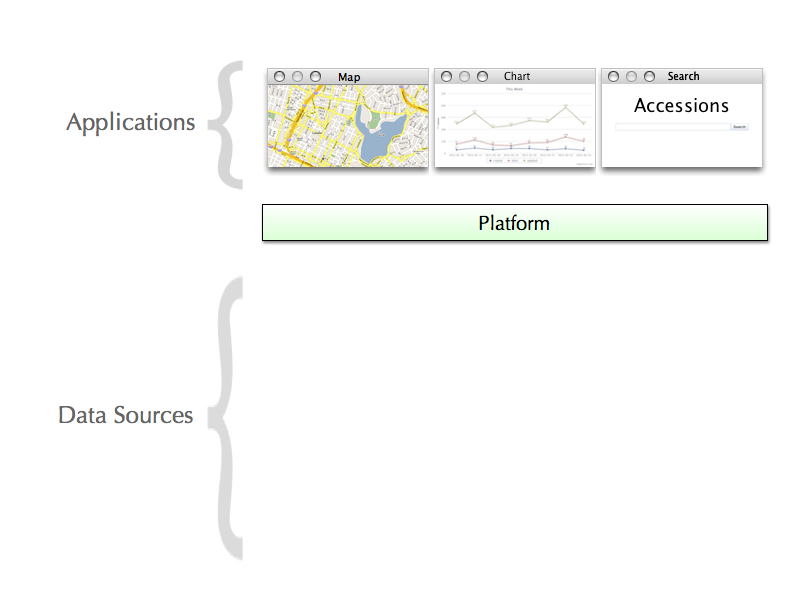

# Genesys 2 *(DRAFT)*

*Older document can be found [here](proposal.html)*.

In this proposal I'll extract the main concepts out of the *6 work-packages* and provide implementation details regarding each one of them.

- [Building a Platform](#platform)
- [Redesigning the Interface](#ui)
- ...

##  Building a Platform

Firstly, let's cover briefly what exactly a Platform is. In a nutshell any application which provides ways to:

- Customize its experience
- Extend its functionality
- Pull data out of it
- Interact with it through a programming interface… is a *Platform*.

By building an application around these concepts we enable others to extend the functionality of our application in ways we didn't think of, or didn't have resources for. This results in more features, developed at a faster pace.

It promotes a truly open and transparent access to data, allowing different teams to work on different functionalities. The teams will only need to know of the platform and standard data exchange formats to be able to interact with the data.  

The components above the platform are **views**. This is the software that the user sees and interacts with. Views interact with the platform by *requesting* data. The map, for example, would request data that has a geographical location associated with it and then display it.

The components below the platform are the **data sources**. All of them make up the many different sources we might have for obtaining data. Through the platform we're abstracting all the implementation details so that we may refactor these components in the future, without ever breaking the views. This is a truly modular design and it will allow developers to more easily develop new tools on top of Genesys' data.

##  Redesigning the Interface

A software project should always start by building its [User Interface](http://en.wikipedia.org/wiki/User_interface). Even though software is made out of many different components, the foremost concern should be appearance—what and how information is presented.

The designer should ask: What is relevant information? What questions will the viewers ask? What situations will they want to compare? What decisions are they trying to make? How can the data be presented most effectively? How can the visual vocabulary and techniques of graphic design be employed to direct the user’s eyes to the solution? The designer must start by considering what the software looks like, because the users are using it to learn, and they learn by looking at it.

Genesys main feature is to provide a way for people to search (and order) **Germplasm accessions**. If a user is searching for this information, what questions might they have? 

- Where do I find samples with specific trait values?
- Where do I find samples with specific passport information?
- Which Genebank holds them?
- Can I download experiments associated to an accession?

The user will use the answers to compare the available Germplasm and decide upon which ones to order.

#### Where do I find samples with specific trait values? 

Consider this redesign:

    

The user is guided through the process of selecting a range of values for a number of traits. They can then filter and download the portion of samples they're interested in. They are able to answer their question immediately, through a single page interface.

#### Where do I find samples with specific passport information?

*more to come…* 