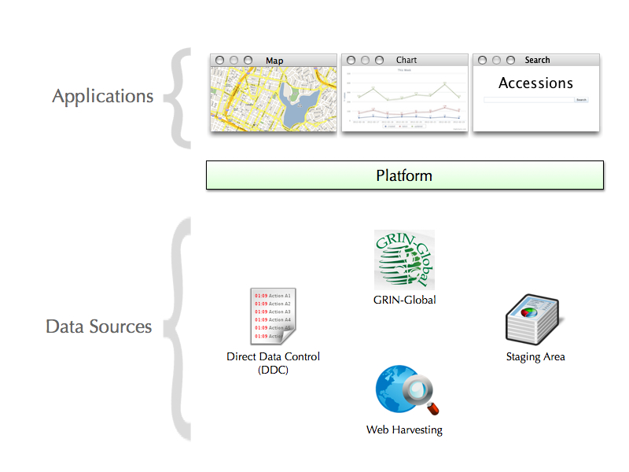

# Genesys 2 (DRAFT)

*Older document can be found [here](proposal.html)*.

In this proposal we'll extract the main concepts out of the *6 work-packages* and provide implementation details regarding each one of them.

- [Building a Platform](#platform)
- [Redesigning the Interface](#ui)

##  Building a Platform

Firstly, let's cover briefly what exactly a Platform is. In a nutshell any application which provides ways to:

- Customize its experience
- Extend its functionality
- Pull data out of it
- Interact with it through a programming interface… is a *Platform*. 

Essentially it's a software program that makes services available to other software programs through Application Programming Interfaces (APIs). For example, Genesys at its current state provides many different useful functionalities. Searching, browsing and filtering data. A platform will let us abstract these services so that other people can customize them and use them more efficiently.

Here's the components the platform will be interacting with:

The components above the platform are **applications**. This is the software that the user sees and interacts with. Applications interact with the platform by *requesting* data. The map, for example, would request data that has a geographical location associated with it and then display it.

The components below the platform are the **data sources**. These are all the different sources we might have for obtaining data. Data sources interact with the platform by *uploading* data. 

#### Why build a Platform?

By building a platform we enable others to extend the functionality of our application in ways we didn't think of, or didn't have resources for. This results in more features, developed at a faster pace.

It promotes an open and transparent access to data, allowing different teams to work on different applications. The teams will only need to know of the platform and standard data exchange formats to be able to interact with the data. 

#### How to build a Platform?

A platform can essentially be considered a "black box". The data-exchange protocols (or APIs) are the only things the users and developers will know about. Details such as "which database does it use" or "what programming language is it built on" are implementation details that the users and developers don't care about. This allows us to update the technology behind the platform to something more performant or easier to maintain, without breaking the applications written on top of it.

The platform will use a [RESTful web API](http://en.wikipedia.org/wiki/Representational_state_transfer#RESTful_web_services) architecture as the foundation of its communication protocol. Some advantages of a RESTful architecture include:

- Simplicity.
- We can make good use of HTTP cache and proxy server to help us handle high load.
- It helps us organize even a very complex system into simple resources.
- It makes it easy for new users to use our system, even if we haven't designed it specifically for them.

##  Redesigning the Interface

A software project should always start by building its [User Interface](http://en.wikipedia.org/wiki/User_interface). Even though software is made out of many different components, the foremost concern should be appearance—what and how information is presented.

The designer should ask: What is relevant information? What questions will the viewers ask? What situations will they want to compare? What decisions are they trying to make? How can the data be presented most effectively? How can the visual vocabulary and techniques of graphic design be employed to direct the user’s eyes to the solution? The designer must start by considering what the software looks like, because the users are using it to learn, and they learn by looking at it.

Genesys main feature is to provide a way for people to search (and order) **Germplasm accessions**. If a user is searching for this information, what questions might they have? 

- Where do I find samples with specific trait values?
- Where do I find samples with specific passport information?
- Which Genebank holds them?
- Can I download experiments associated to an accession?

The user will use the answers to compare the available Germplasm and decide upon which ones to order.

#### Where do I find samples with specific trait values? 

Consider this redesign:

    

The user is guided through the process of selecting a range of values for a number of traits. They can then filter and download the portion of samples they're interested in. They are able to answer their question immediately, through a single page interface.

#### Where do I find samples with specific passport information?

*more to come…* 